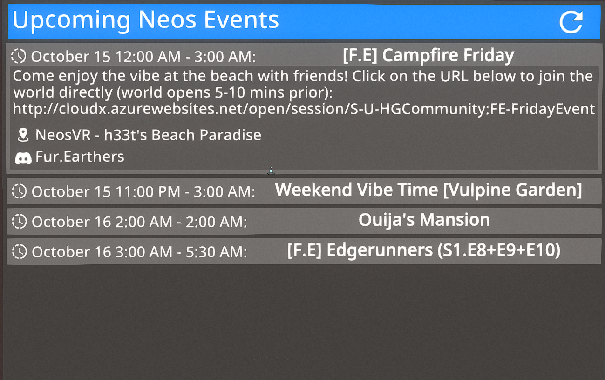
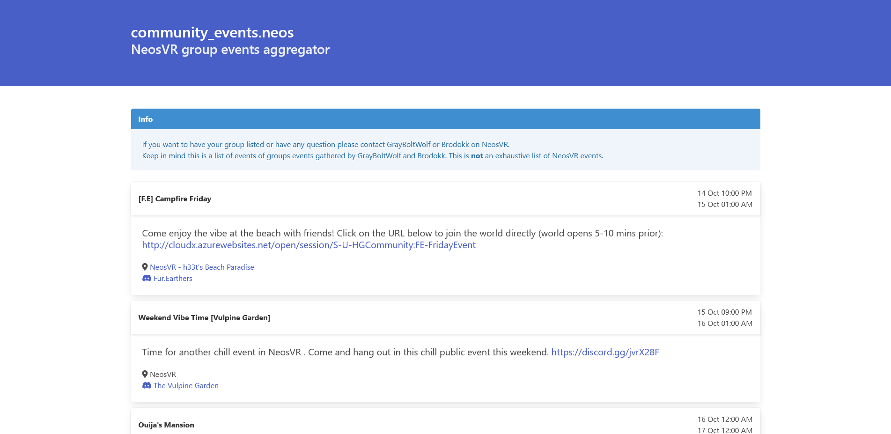

# community_event.resonite

Small API for getting the events in multiple discord servers and Google Agenda with easier parsing for Resonite.

This tool has been write in a way that different  community can host their own server and can be connected to
each other. There is a main instance available at [resonite-community.events](https://resonite-community.events).
# Use

This is the new version 2.0, not tested in production yet, please see the git tag for the version 1.0.

## Configuration

Most of the configuration of this tool are available in the `config.toml` file and the following configuration
keys are available:

- `DISCORD_BOT_TOKEN`: The bot token, in a string format.
- `SERVERS_EVENT`: A list of string URL of other events server to aggregate in the format of 'scheme://host:port'
- `SHOW_WEBUI`: Enable or now the WebUI, depend if the tool will be used as an API only or no.


The different source of information are separated in modules. Each module have is own configuration per
event.

**Note**: If the configuration is change you should **clean** the Redis database!

### DiscordScheduledEvents

The source module for discord integrated schedule event system.
For adding a guild to this source you need to use the key
`[[BOTS.DiscordScheduledEvents]]` and add the following key:

- `community_name`: str, the name of the community
- `community_description`: str, the description of the community
- `community_url`: str, the URL where to find this community, can be a discord invite link or a website
- `tags`: list, the list of tags
- `guild_ids`: int, the guild id

### ResoniteCalendarTransmitter

**Not**: Not yet available

It's possible to send all events in a cloud variable to be used by JackTheOtter calendar system.

- `CLOUDVAR_RESONITE_USER`: str, the `U-` Resonite username used to set the cloud variable
- `CLOUDVAR_RESONITE_PASS`: str
- `CLOUDVAR_BASE_NAME`: str, the Resnonite cloud variable base name
- `CLOUDVAR_GENERAL_NAME`: str, the Resnonite cloud variable general name

#### Example

```
[[BOTS.DiscordScheduledEvents]]
community_name = "The Vulpine Garden"
community_description = "The Vulpine Garden Community"
community_url = "https://discord.gg/GwQXurvt"
tags = ['karaoke']
guild_id = xxxxxxxxxxxxxxxxxx
```

### GoogleCalendar

The source module for fetch events from Google Calendar.
For adding a guild to this source you need to use the key
`[[BOTS.GoogleCalendar]]` and add the following keys:

- `communities_name`: list, the list of the names of the communities handled by this Google calendar
- `email`: str, the email of the Google calendar
- `credentials_file`: str, the path of the configuration file


#### Example

```
[[BOTS.GoogleCalendar]]
communities_name = ['Creator Jam']
email = "rdklsjhuifkufgitpf1p450n6td04@group.calendar.google.com"
credentials_file = 'credentials.json'
```

### Apollo

The source module for fetch events from the Discord Apollo bot.
For adding a guild to this source you need to use the key
`[[BOTS.Apollo]]` and add the following keys:

- `community_name`: str, the name of the community
- `community_description`: str, the description of the community
- `community_url`: str, the URL where to find this community, can be a discord invite link or a website
- `tags`: list, the list of tags
- `guild_ids`: int, the guild id
- `guild_channel`:  str, the name of the channel where the Apollo bot is publishing new events
- `bot`: int, the bot id

#### Example

```
[[BOTS.Apollo]]
community_name = "The Vulpine Garden"
community_description = "The Vulpine Garden Community"
community_url = "https://discord.gg/GwQXurvt"
tags = ['karaoke']
guild_id = xxxxxxxxxxxxxxxxxx
guild_channel = "events"
bot = xxxxxxxxxxxxxxxxxx
```

## Docker

As an example there is a compose file for start the full project really
easy.

## Metal

If you want to launch the project without docker you will need a
Redis database. This project is then separated in two parts,
the calendar update system and the calendar application by itself.
This two parts can be executed separately and are totally independent
from each other but the two depend of the redis database to work.

For the two applications there is an env variable for set the
redis host: `REDIS_HOST`, it default to `cache`.

## Calendar update system

The calendar update system work in a way that its always listen to
discord events and as a cron job, every 5 minutes to check for missed
events or in case of a reboot of this system.

The calendar update system can simply by launch via:

```
python bot.py
```
### Modularity note

The `bots` folder contains a list of modules to get events from. While
most of them are and will be for discord bot there is actually two
exception, for now. The module called `google` and `discord` are
for Google Calendar and Discord integrated event system. All of the
bot are based on the class `Bot` in the `_base.py` file.

## Calendar application

The calendar application is the system who will handle both API and
web request for now.

The calendar application can simply by launch via

```
gunicorn -w 4 -b 0.0.0.0:5000 app:app
```

# Endpoints

## V1

**Note**: This endpoint is noted as deprecated

- `/v1/events`: return the list of the event in an easy readable format for Resonite: ```name`description`location`start_time`end_time`community_name\n\r```
  Note: The last line don't have `\n\r`
- `/v1/aggregated_events`: same format as `/v1/events` but return the list of aggragated events from this instance with the ones from the instance listed in the config variable `SERVER_EVENTS`
- `/`: WebUI client

Both endpoints `events` and `aggregated_events` have the possibility to have only some community
listed with the querystring `communities` who take as a parameters a list of community name
separated by a coma.
They also return a list of events from a Google calendar. See configuration below.

## V2

- `/v2/communities`: return the list of the communities available on this event server
  `/v2/events`: return the list of the event in an easy readable format for Resonite: ```\n\r```
  Note: The last line don't have `\n\r`
- `/v2/aggregated_events`: same format as `/v2/events` but return the list of aggragated events from this instance with the ones from the instance listed in the config variable `SERVER_EVENTS`
- `/`: WebUI client

# Resonite facet client

Its possible to see the list of events available in Resonite via a facet.
You can find the last version available in the public folder at this
address: `resrec:///U-GrayBoltWolf/R-6D21762A77D6D5F16D03C0163191BD068DCBA62DC7869C1C64E916ECDEFDEBC9`



# WebUI client

The WebUI client is directly using the functions internally and don't talk to the API in HTTP. Its use a simple css
framework called [Bulma](https://bulma.io/) and are loaded directly from differents CDN for now.

Date are formated directly without taking in account of the timezone of the webbrowser.

There is a support of the discord timestamp but only for the `R` format.

And the resonite session URL is automaticaly detected from the description if no URL already present in the locatization parameter.
It will automaticaly use the first, and only the first, URL starting with `http(s)://cloudx.azurewebsites.net` for set the locatization
parameter.



# Add a google agenda

For adding a google agenda you need:

- create a Google calendar with your personal account
- create, or use, a Google Cloud Plateform account and create a new project. Enable the calendar API on it and create a `Service Account` with a `json` API key. Then you need to add the email of this Service Account API key as an authorized user of your personal Google calendar.
- Copy the `json` file next to the project or where you want on the system.
- Update the `config.toml` configuration depending on your need.

Note: The id of the calendar is in the settings of your Google Calendar under calendar integration.

# Note

For found what is the id of a guild you can use the script `get_discord_server_list.py` who return the list of guild where the bot is
present.

# Event creator usage notes

Since the source can also contains event who can happen in different location, either virtually or physically, the keyword
`Resonite` must be specified either in the `title`, the `description`, or the `location` of an event. New lines and some special
chars before being lowered.

## Apollo bot

The Apollo bot is a special case since this bot doesn't support a 'location' field this one must be added in the description in the
following format: `Location: <event location>`. For a correct detection this field should be on his own line. Don't forget to put a
carriage return if you add test after and put a space before the `L`.
