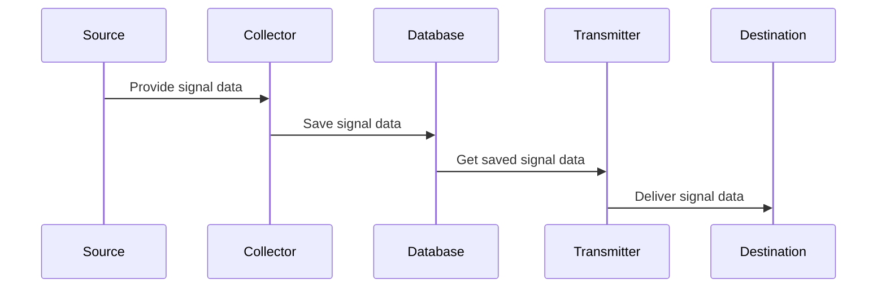

!!! construction "To be completed"

A **signal** represents a piece of information coming from a source, being processed, and then sent somewhere else.

## High-Level Architecture

- **Sources**: External services or systems providing data.
- **Collectors**: Components that fetch or receive data from sources.
- **Database**: Internal logic that save the signals data.
- **Transmitters**: Components that send processed signals to outputs.
- **Destination**: External services or systems data to share too.

## Applications in this Repository

### Signal Manager

Handles collectors and transmitters. Runs each on a schedule.

### Backend API

Serves requests from any client either in JSON or TEXT.

### Web Client (deprecated)

Currently the only frontend. While this is considered as deprecated the development of features
are still happening on this frontend for now.

## Extending the system

### Adding a new Collector

To add a new data source to the system, you'll need to implement a new Collector. All collectors should inherit from the `resonite_communities.signals.collector.Collector` base class.

1.  **Create a new module**: In the `resonite_communities/signals/collectors` directory, create a new Python file for your collector (e.g., `my_new_collector.py`).
2.  **Implement the `Collector` interface**: Your class should inherit from `Collector` and implement the required methods, such as `collect` to retrieve data from your source.
3.  **Register your collector**: Ensure your new collector is discoverable by the system. This typically involves adding it to the `__all__` dictionary in `resonite_communities/signals/collectors/__init__.py`.
4.  **Add configuration**: THIS STILL NEED TO EXPLAIN

### Adding a new Transmitter

To send processed signals to a new destination, you'll need to implement a new Transmitter. All transmitters should inherit from the `resonite_communities.signals.transmitter.Transmitter` base class.

1.  **Create a new module**: In the `resonite_communities/signals/transmitters` directory, create a new Python file for your transmitter (e.g., `my_new_transmitter.py`).
2.  **Implement the `Transmitter` interface**: Your class should inherit from `Transmitter` and implement the required methods, such as `transmitt` to deliver data to your destination.
3.  **Register your transmitter**: Ensure your new transmitter is discoverable by the system. This typically involves adding it to the `__all__` dictionary in `resonite_communities/signals/transmitters/__init__.py`.
4.  **Add configuration**: THIS STILL NEED TO EXPLAIN
